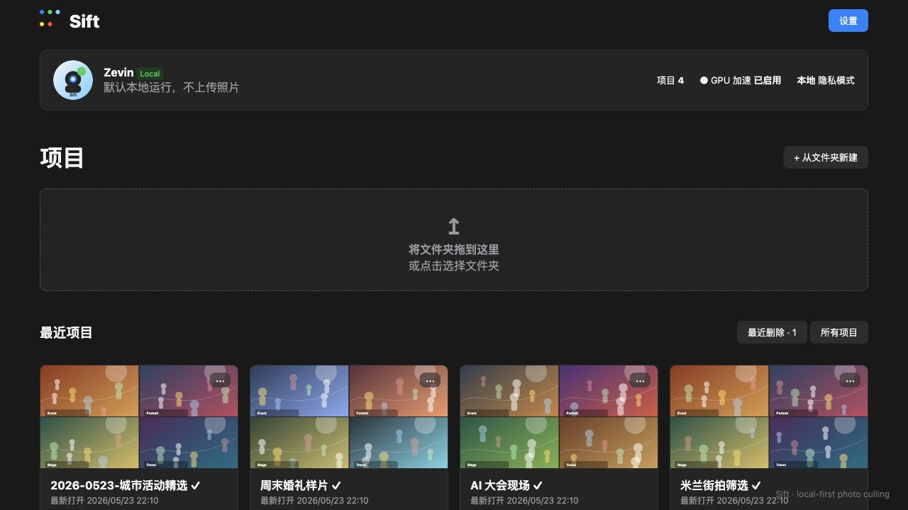

<h1 align="center">Sift</h1>

<p align="center">
  <b>A local-first desktop photo culling app for photographers who come home with too many shots and too little time.</b>
</p>



<div style="display: flex; justify-content: center; gap: 10px; flex-wrap: wrap; width: 100%;">
  <a href="https://github.com/chencn2020/Sift/releases"></a>
  <a href="https://tauri.app/"></a>
  <a href="./LICENSE"></a>
  <a href="./COMMERCIAL-LICENSE.md"></a>
  <a href="https://github.com/chencn2020/Sift/stargazers"></a>
</div>

:rocket: :rocket: :rocket: **News:**

- ✅ **May 23, 2026**: We withdraw `v0.1.0-alpha.1`, switch Sift to a noncommercial source-available license, and prepare `v0.1.0-alpha.2`.
- ✅ **May 23, 2026**: We release the first desktop preview workflow: project library, grid culling, focus view, compare view, ratings, pick/reject states, and person registration.
- ✅ **May 23, 2026**: We add local project persistence, thumbnail browsing cache, recently deleted projects, and early Windows/macOS packaging.
- ✅ **May 23, 2026**: We create the Sift repository.

## TODO List

- [x] Release the first desktop preview for macOS and Windows.
- [x] Add project library, recent projects, and recently deleted projects.
- [x] Add grid, focus, and compare views for photo culling.
- [x] Add pick/reject flags and star ratings.
- [x] Add person registration with reference photos.
- [ ] Add face detection and person matching.
- [ ] Add duplicate and burst-group detection.
- [ ] Add blink / closed-eye detection.
- [ ] Add technical quality and aesthetic scoring models.
- [ ] Add signed releases and production auto-update.

## Contents

1. [Introduction](#Introduction)
2. [Try Sift](#Try-Sift)
3. [Run Sift](#Run-Sift)
4. [Features](#Features)
5. [AI Roadmap](#AI-Roadmap)
6. [License](#License)
7. [Stars](#Stars)

中文文档：[README.zh-CN.md](README.zh-CN.md)

<div id="Introduction"></div>

## Introduction

<b>TL;DR:</b> Sift is a desktop tool for event, wedding, travel, portrait, and conference photographers who need to quickly turn a large shoot folder into a clean set of keepers.

Large photo shoots are not hard because one image is hard to judge. They are hard because there are too many near-duplicates, missed-focus shots, awkward expressions, repeated burst frames, and people-specific selections. Sift aims to make that workflow fast, visual, private, and calm.

Sift is local-first by default. Your original photos stay on your machine, culling decisions are stored separately, and future cloud AI providers should only run when a user explicitly enables them for a project.

<div id="Try-Sift"></div>

## Try Sift

Download the latest preview build from the GitHub Releases page:

<a href="https://github.com/chencn2020/Sift/releases"></a>

Current preview targets:

- macOS desktop app.
- Windows installer.
- Local-first photo culling workflow.

> [!IMPORTANT]
> Sift is an early alpha. It is useful for testing the product direction, but the AI-assisted workflow and production signing are still under active development.

<div id="Run-Sift"></div>

## Run Sift

### Preparation

Install the required desktop development toolchain:

```bash
npm install
```

Tauri development also requires Rust and the native build tools for your platform.

### Development

Run the desktop app locally:

```bash
npm run tauri:dev
```

### Build

Build a local desktop app:

```bash
npm run tauri:build
```

Run checks:

```bash
npm run build
npm test
npm run python:test
cargo check --manifest-path src-tauri/Cargo.toml
```

<div id="Features"></div>

## Features

- Import and manage large photo shoots as desktop projects.
- Browse photos in a fast grid view.
- Use focus view for one-photo culling, zoom, and metadata review.
- Use compare view to choose between similar frames.
- Mark photos as picked or rejected.
- Rate photos and projects with stars.
- Register important people with reference photos.
- Recover projects from Recently Deleted.
- Keep the default workflow local and non-destructive.

<div id="AI-Roadmap"></div>

## AI Roadmap

Sift is designed for local AI-assisted culling. The next major work is:

- Face detection and person matching.
- Duplicate photo detection.
- Blink / closed-eye detection.
- Focus, exposure, noise, and motion-blur quality scoring.
- Aesthetic evaluation for composition, expression, and delivery potential.
- Burst recommendation: choose the strongest image from a repeated sequence.
- Local model management with optional cloud providers only when explicitly enabled.

<div id="License"></div>

## License

Sift uses a noncommercial source-available license.

- Code: [PolyForm Noncommercial License 1.0.0](./LICENSE)
- Documentation, screenshots, and media: [CC BY-NC 4.0](./LICENSE-DOCS.md)
- Commercial use: [separate commercial license required](./COMMERCIAL-LICENSE.md)

Commercial use, company-internal use, resale, SaaS integration, commercial studio deployment, or product bundling is not permitted under the public repository license.

> [!NOTE]
> `v0.1.0-alpha.1` was withdrawn from GitHub Releases because it was published with incorrect MIT license metadata. Future releases use the noncommercial licensing policy above.

<div id="Stars"></div>

## Stars

<a href="https://star-history.com/#chencn2020/Sift&Date">
 <picture>
   <source media="(prefers-color-scheme: dark)" srcset="https://api.star-history.com/svg?repos=chencn2020/Sift&type=Date&theme=dark" />
   <source media="(prefers-color-scheme: light)" srcset="https://api.star-history.com/svg?repos=chencn2020/Sift&type=Date" />
   
 </picture>
</a>
